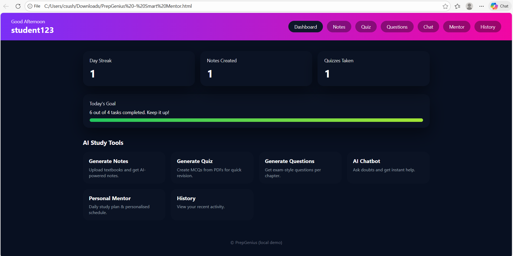
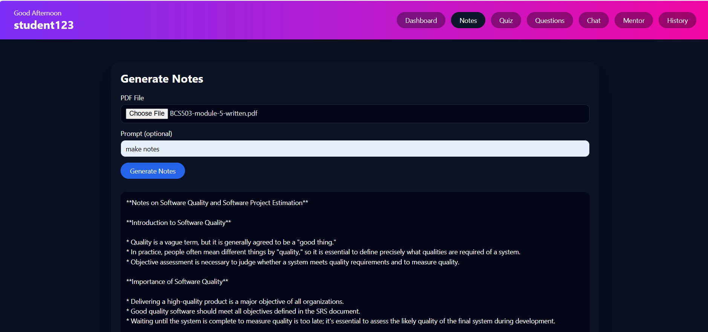
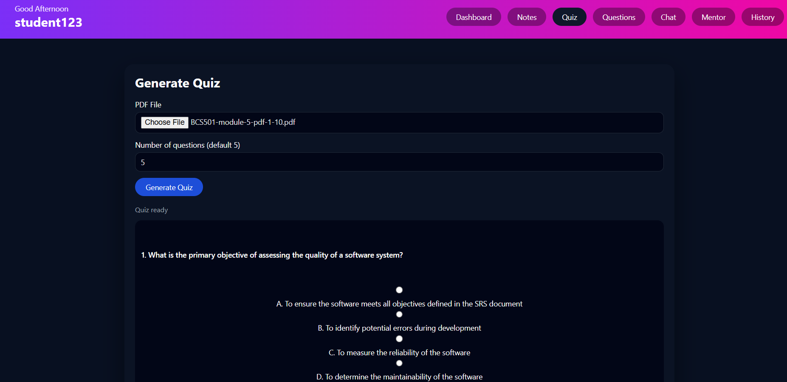

# PrepGenius – AI-Powered Study Assistant 🚀

PrepGenius is an AI-driven web application designed to help students prepare for exams and interviews efficiently. It automatically generates notes, quizzes, descriptive questions, and personalized study plans from PDF study materials using Large Language Models (LLMs).

---

## 🔥 Features
- AI-generated notes from PDFs
- Automatic MCQ quiz generation with scoring
- Descriptive exam-style question generation
- Personalized study planner (AI Mentor)
- Interactive AI chatbot for doubt-solving
- Activity history tracking
- Downloadable outputs (notes, quizzes, plans)

---

## 🧠 AI & ML Concepts Used
- Transformer-based Large Language Models (LLMs)
- Natural Language Processing (NLP)
- Prompt engineering for structured output
- Automated text summarization and question generation

---

## 🛠️ Tech Stack
- **Frontend:** HTML, CSS, JavaScript
- **Backend:** Python (Flask)
- **AI Model:** Groq LLM (LLaMA 3.1)
- **Database:** SQLite
- **PDF Processing:** PyPDF2

---

## 📸 Screenshots




---

## ▶️ How to Run Locally

```bash
pip install -r requirements.txt
python app.py
